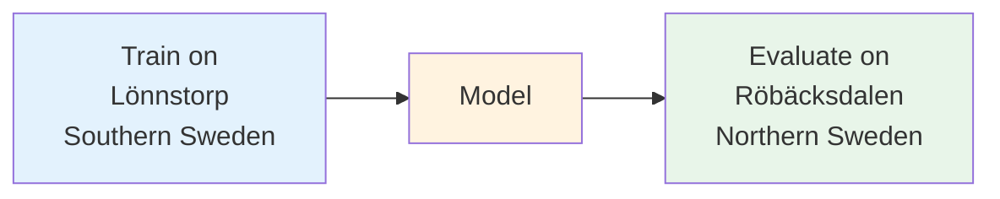
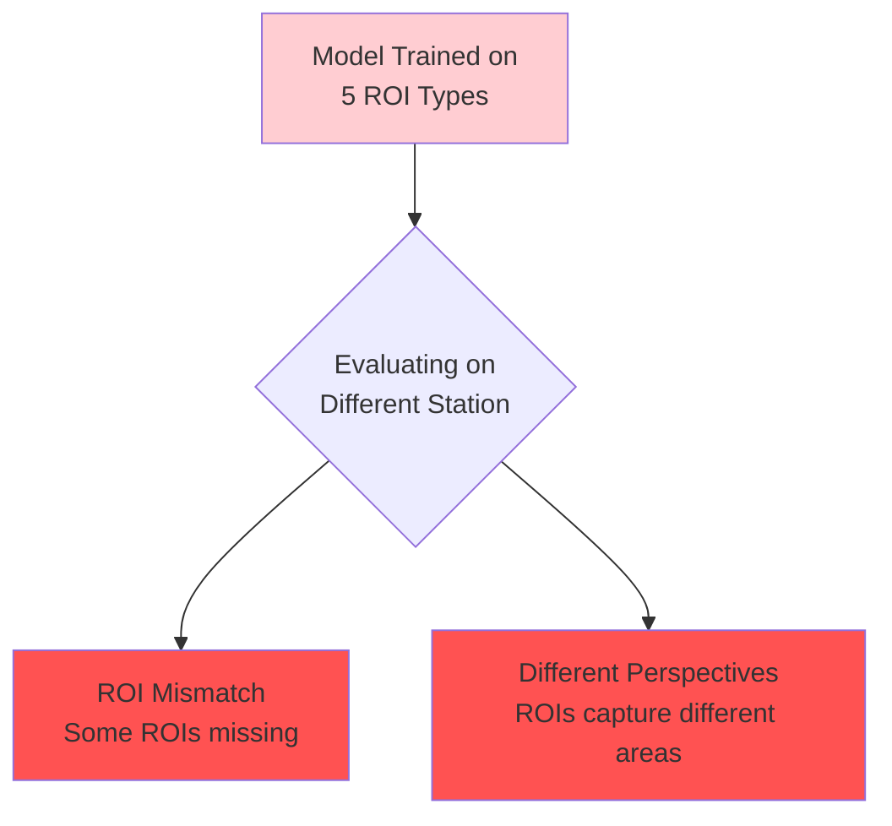
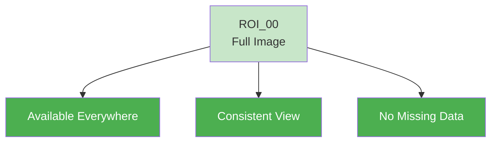
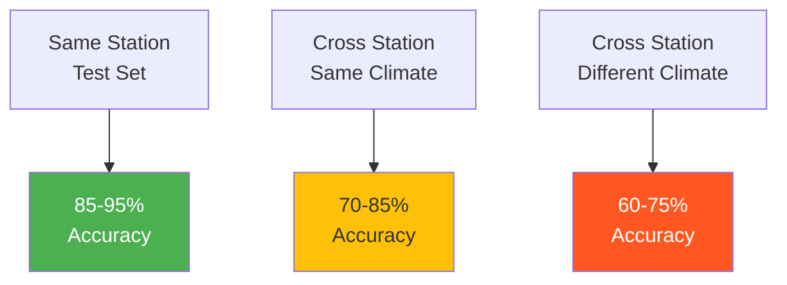

# Cross-Station Evaluation Guide

## Overview

Cross-station evaluation tests how well a model trained at one location performs at another location. This is crucial for understanding model generalization and robustness across different geographical and environmental conditions.



## The ROI Challenge

Different stations have different ROI (Region of Interest) configurations:

### Station ROI Configurations

| Station | Instrument | ROIs Available |
|---------|-----------|----------------|
| **Lönnstorp** | PHE01 | ROI_00, ROI_01, ROI_02, ROI_03, ROI_06 |
| **Lönnstorp** | PHE02 | ROI_00, ROI_01, ROI_02, ROI_03, ROI_04 |
| **Röbäcksdalen** | PHE01 | ROI_00, ROI_01 |
| **Abisko** | PHE01 | ROI_00, ROI_01, ROI_02, ROI_03 |

### Why This Matters



## Solution: ROI_00 Universal Approach

ROI_00 is special - it's the **full image** (excluding sky) and is automatically generated for every image at every station.



## Workflow 1: Cross-Station Evaluation

### Step 1: Create Training Dataset (All Lönnstorp Data)
```bash
# Use ALL Lönnstorp data for training (no test split)
uv run phenocai dataset create \
    --roi-filter ROI_00 \
    --test-size 0.0 \
    --val-size 0.2 \
    --no-complete-rois-only

# Output: lonnstorp_PHE01_dataset_2024_roi_00_splits_0_20.csv
# Contains: 1460 ROI_00 samples (100% of images)
```

### Step 2: Train Model
```bash
# Train on all Lönnstorp ROI_00 data
uv run phenocai train model \
    lonnstorp_PHE01_dataset_2024_roi_00_splits_0_20.csv \
    --preset mobilenet_full

# Model learns snow patterns from southern Sweden agriculture
```

### Step 3: Create Evaluation Dataset (Röbäcksdalen)
```bash
# Switch to northern station
uv run phenocai station switch robacksdalen

# Create evaluation dataset
uv run phenocai dataset create \
    --roi-filter ROI_00 \
    --output robacksdalen_eval.csv

# Contains: Different climate, lighting, snow patterns
```

### Step 4: Evaluate Cross-Station Performance
```bash
# Test southern model on northern data
uv run phenocai evaluate model \
    /path/to/lonnstorp_model/final_model.h5 \
    robacksdalen_eval.csv \
    --output-dir cross_station_results
```

## Workflow 2: Multi-Station Training

Train a single model on data from multiple stations for better generalization:

### Step 1: Create Multi-Station Dataset
```bash
# Combine data from multiple stations
uv run phenocai dataset multi-station \
    --stations lonnstorp robacksdalen abisko \
    --roi-filter ROI_00 \
    --test-size 0.2 \
    --val-size 0.1

# Output: multi_station_lonnstorp_robacksdalen_abisko_dataset_2024_roi_00_splits_20_10.csv
```

### Step 2: Train Universal Model
```bash
# Train on diverse data
uv run phenocai train model \
    multi_station_dataset.csv \
    --preset mobilenet_full \
    --output-dir universal_snow_model
```

## Workflow 3: Station-Specific ROI Models

For within-station evaluation using all ROIs:

### Option A: Complete ROI Sets (Recommended)
```bash
# Lönnstorp with all 5 ROIs (from day 32+)
uv run phenocai dataset create  # Default behavior

# Output: lonnstorp_PHE01_dataset_2024_from_day32_splits_20_10.csv
# Balanced ROI representation
```

### Option B: Specific ROI Analysis
```bash
# Compare different field areas
uv run phenocai dataset create --roi-filter ROI_01  # Main field
uv run phenocai dataset create --roi-filter ROI_06  # Different angle

# Train separate models and compare performance
```

## Expected Performance Patterns

### Cross-Station Evaluation Results



### Factors Affecting Cross-Station Performance

1. **Climate Differences**
   - Southern vs Northern Sweden
   - Coastal vs Inland
   - Different snow types

2. **Vegetation Differences**
   - Agricultural fields
   - Forest clearings
   - Different crop types

3. **Camera Setup**
   - Mounting height
   - Viewing angle
   - Camera model

## Best Practices

### 1. Always Use ROI_00 for Cross-Station Work
```bash
# Good: Universal compatibility
--roi-filter ROI_00

# Bad: ROI might not exist at target station
--roi-filter ROI_06
```

### 2. Document Station Differences
Track these factors when comparing results:
- Latitude/Climate zone
- Ecosystem type (agriculture, forest)
- Typical weather patterns
- Camera specifications

### 3. Create Baseline Comparisons
```bash
# 1. Within-station baseline
Train: Lönnstorp 2023, Test: Lönnstorp 2024

# 2. Similar climate cross-station
Train: Lönnstorp, Test: Skåne (both southern)

# 3. Different climate cross-station  
Train: Lönnstorp, Test: Abisko (south to arctic)
```

### 4. Use Ensemble Approaches
```python
# Combine predictions from multiple models
southern_model = load_model('lonnstorp_model.h5')
northern_model = load_model('robacksdalen_model.h5')
universal_model = load_model('multi_station_model.h5')

# Average predictions for robustness
final_prediction = np.mean([
    southern_model.predict(image),
    northern_model.predict(image),
    universal_model.predict(image)
], axis=0)
```

## Interpreting Results

### Good Cross-Station Performance (>80%)
- Model learned generalizable snow features
- Similar environmental conditions
- Ready for deployment

### Moderate Performance (60-80%)
- Some generalization achieved
- Consider multi-station training
- May need station-specific fine-tuning

### Poor Performance (<60%)
- Significant environmental differences
- Need station-specific models
- Consider ensemble approach

## Quick Reference Commands

```bash
# Single-station ROI_00 dataset
uv run phenocai dataset create --roi-filter ROI_00

# Multi-station ROI_00 dataset
uv run phenocai dataset multi-station \
    --stations lonnstorp robacksdalen \
    --roi-filter ROI_00

# Train with no test split (use all data)
uv run phenocai dataset create \
    --roi-filter ROI_00 \
    --test-size 0.0 \
    --val-size 0.2

# Evaluate on different station
uv run phenocai evaluate model \
    trained_model.h5 \
    other_station_dataset.csv
```

## Summary

- **ROI_00** enables fair cross-station comparison
- **Expect 10-30% accuracy drop** across different climates
- **Multi-station training** improves generalization
- **Document environmental factors** affecting performance
- **Consider ensemble methods** for production deployment