# Complete PhenoCAI Workflow Guide

## The Full Journey: From Photos to Knowledge 🌟

This guide shows how all the pieces fit together in the PhenoCAI system.

```mermaid
graph TB
    subgraph Input
        A[📷 Phenocam Photos<br/>Every 3 hours]
        B[👤 Human Labels<br/>Snow, Flags]
    end
    
    subgraph Data Preparation
        C[📊 Create Dataset]
        D[✂️ Split Data<br/>70/10/20]
        E[🔍 Quality Analysis]
    end
    
    subgraph Training
        F[🧠 Neural Network<br/>MobileNetV2]
        G[📚 Learn Patterns]
        H[💾 Save Model]
    end
    
    subgraph Evaluation
        I[🎯 Test Performance]
        J[📈 Calculate Metrics]
        K[✅ Validate Results]
    end
    
    subgraph Production
        L[🚀 Deploy Model]
        M[📸 New Photos]
        N[🏷️ Auto-Label]
        O[📊 Research Data]
    end
    
    A --> C
    B --> C
    C --> D
    D --> E
    E --> F
    F --> G
    G --> H
    H --> I
    I --> J
    J --> K
    K --> L
    L --> M
    M --> N
    N --> O
    
    style A fill:#e3f2fd
    style B fill:#fff3e0
    style H fill:#c5e1a5
    style K fill:#4caf50,color:#fff
    style O fill:#ffd700
```



## Quick Reference: Commands for Each Stage

### 1️⃣ Setup and Configuration
```bash
# Install and configure
uv sync
source src/phenocai/config/env.sh

# Check setup
uv run phenocai info
uv run phenocai config validate
```

### 2️⃣ Data Preparation
```bash
# Create dataset with train/test/val splits
uv run phenocai dataset create --output data.csv \
    --test-size 0.2 \
    --val-size 0.1

# The dataset now includes:
# - file_path: Full path with day-of-year subdirectory
# - has_flags: Boolean for quick quality filtering
# - split: train/test/val assignment

# Analyze quality
python scripts/analyze_quality_issues.py data.csv

# Filter if needed
uv run phenocai dataset filter data.csv clean_data.csv \
    --exclude-flags fog high_brightness
```

### 3️⃣ Training
```bash
# Train model with MobileNetV2
uv run phenocai train model clean_data.csv \
    --model-type mobilenet \
    --epochs 20 \
    --batch-size 32

# The model learns to predict:
# - snow_presence: Binary classification
# - Quality issues for discard detection
```

### 4️⃣ Evaluation
```bash
# Evaluate model
uv run phenocai evaluate model saved_model.h5 test_data.csv \
    --save-predictions \
    --generate-plots

# Generates:
# - Accuracy, precision, recall metrics
# - Confusion matrices
# - Performance by quality condition
```

### 5️⃣ Prediction
```bash
# Predict single image
uv run phenocai predict apply saved_model.h5 \
    --image path/to/image.jpg

# Batch process entire directory
uv run phenocai predict batch saved_model.h5 \
    --directory /2024/ \
    --output-dir predictions/ \
    --format yaml

# Process specific date range
uv run phenocai predict batch saved_model.h5 \
    --start-day 100 \
    --end-day 200 \
    --year 2024 \
    --output-dir seasonal_predictions/

# Export predictions
uv run phenocai predict export predictions/ \
    --format csv \
    --output results.csv
```

## Key Decision Points 🤔

### 1. Data Quality Decisions


### 2. Model Selection


### 3. Threshold Settings


## Real-World Example: Complete Pipeline

### Processing a Full Year of Lönnstorp Data

```bash
# 1. Setup environment
source src/phenocai/config/env_lonnstorp.sh
python src/phenocai/config/setup.py

# 1b. Check available instruments and switch if needed
uv run phenocai station instruments
uv run phenocai station switch lonnstorp --instrument LON_AGR_PL01_PHE01

# 2. Create dataset with annotations (auto-named)
uv run phenocai dataset create \
    --test-size 0.2 \
    --val-size 0.1
# Creates: lonnstorp_PHE01_dataset_2024_splits_20_10.csv

# 3. Check data quality
python scripts/analyze_quality_issues.py lonnstorp_PHE01_dataset_2024_splits_20_10.csv
# Output: 1,547 total samples
#   - 404 clean (no flags): 26.1%
#   - 1,143 with quality issues: 73.9%

# 4. Train on clean subset first (auto-generates filename)
uv run phenocai dataset filter lonnstorp_PHE01_dataset_2024_splits_20_10.csv --no-flags
# Creates: lonnstorp_PHE01_dataset_2024_splits_20_10_clean_filtered.csv
    
uv run phenocai train model lonnstorp_PHE01_dataset_2024_splits_20_10_clean_filtered.csv \
    --model-type mobilenet \
    --epochs 20 \
    --output-dir models/clean_baseline/

# 5. Evaluate performance
uv run phenocai evaluate model models/clean_baseline/final_model.h5 \
    lonnstorp_PHE01_dataset_2024_splits_20_10_clean_filtered.csv --split test

# 6. Apply to full year of new images
uv run phenocai predict batch models/clean_baseline/final_model.h5 \
    --year 2024 \
    --output-dir predictions/2024/ \
    --format yaml \
    --use-heuristics

# 7. Export results for analysis
uv run phenocai predict export predictions/2024/ \
    --format csv \
    --output lonnstorp_PHE01_2024_predictions.csv
```

### Results You Can Expect

```yaml
# Example prediction output (predictions/2024/102/predictions.yaml)
lonnstorp_LON_AGR_PL01_PHE01_2024_102_20240411_080003.jpg:
  - roi_name: ROI_00
    snow_presence: false
    snow_probability: 0.12
    confidence: 0.88
    quality_flags: []
    discard: false
    has_flags: false
    
  - roi_name: ROI_01
    snow_presence: true
    snow_probability: 0.95
    confidence: 0.95
    quality_flags: ['partial_snow']
    discard: false
    has_flags: true
```

## Common Workflows

### Workflow A: Clean Data First-Time Training


**Best for**: Getting started quickly with reliable results

### Workflow B: Progressive Training


**Best for**: Gradually improving model robustness

### Workflow C: Condition-Specific Models


**Best for**: Maximum accuracy across all conditions

## Performance Expectations 📊

### By Data Quality


### By Training Data Size


## Troubleshooting Guide 🔧


## Tips for Success 🎯

### 1. Start Simple
- ✅ Use filtered dataset first
- ✅ Train basic model
- ✅ Get baseline results
- ✅ Then add complexity

### 2. Monitor Everything
- 📊 Track accuracy over time
- 📈 Log confidence scores
- 🔍 Review random samples
- 📝 Document changes

### 3. Iterate Frequently
- 🔄 Small improvements
- 🧪 Test each change
- 📊 Measure impact
- 🎯 Keep what works

## The Big Picture 🌍


## Remember: You're Part of Something Important! 🌟

Every photo labeled, every model trained, and every prediction made contributes to:
- 🌡️ Understanding climate change
- 🌱 Monitoring ecosystem health
- 📊 Providing data for research
- 🌍 Protecting our environment

## Next Steps

1. **Practice**: Try the commands with sample data
2. **Experiment**: Test different settings
3. **Learn**: Understand what works best
4. **Contribute**: Share your findings

## Need Help?

- 📖 Review individual workflow guides
- 💬 Ask the development team
- 🐛 Report issues on GitHub
- 📚 Check the documentation

Good luck with your PhenoCAI journey! 🚀