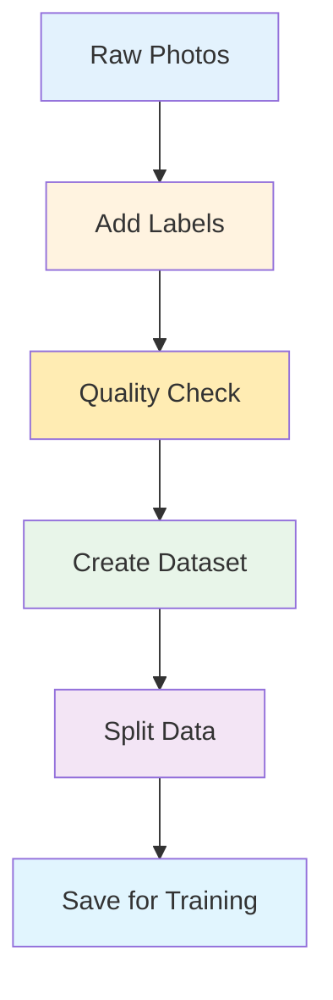
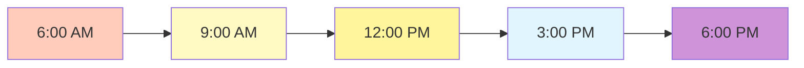
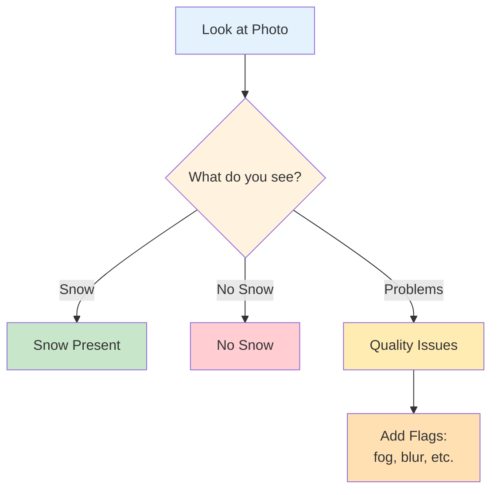
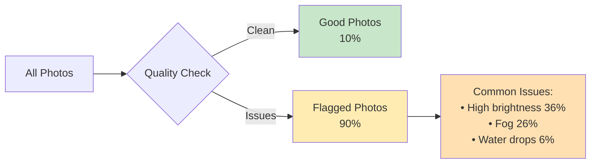
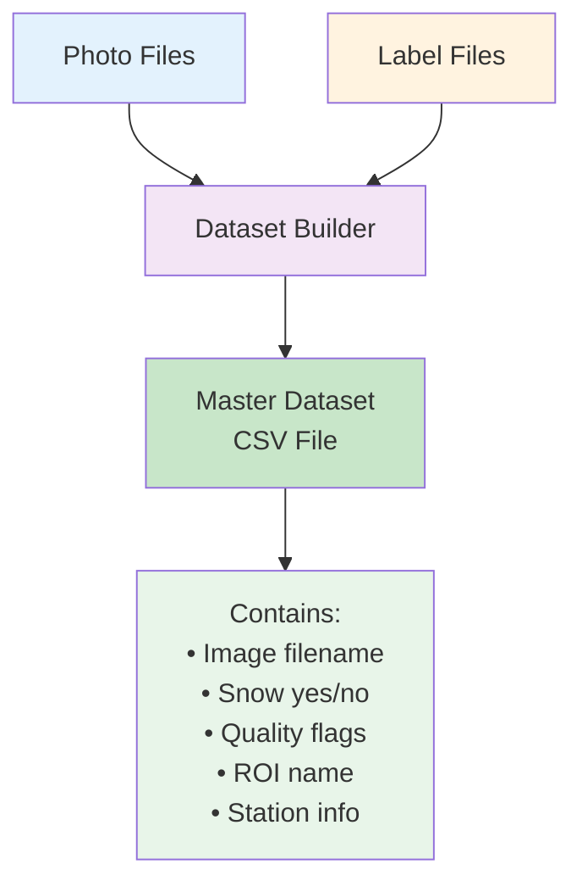
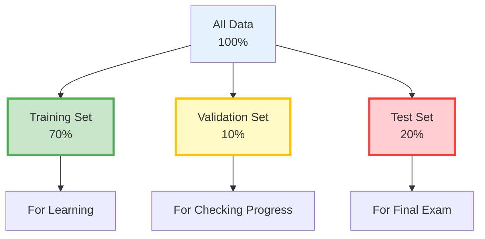
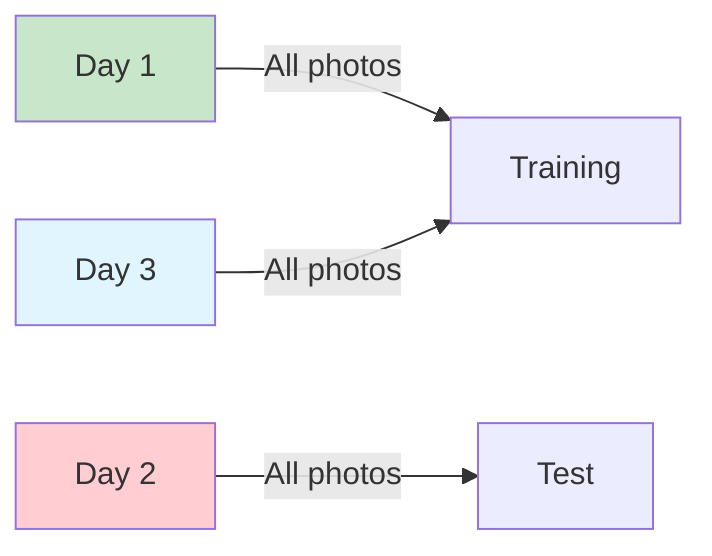
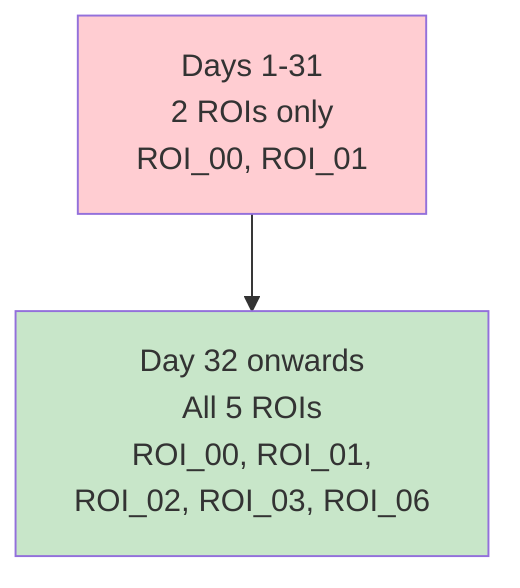
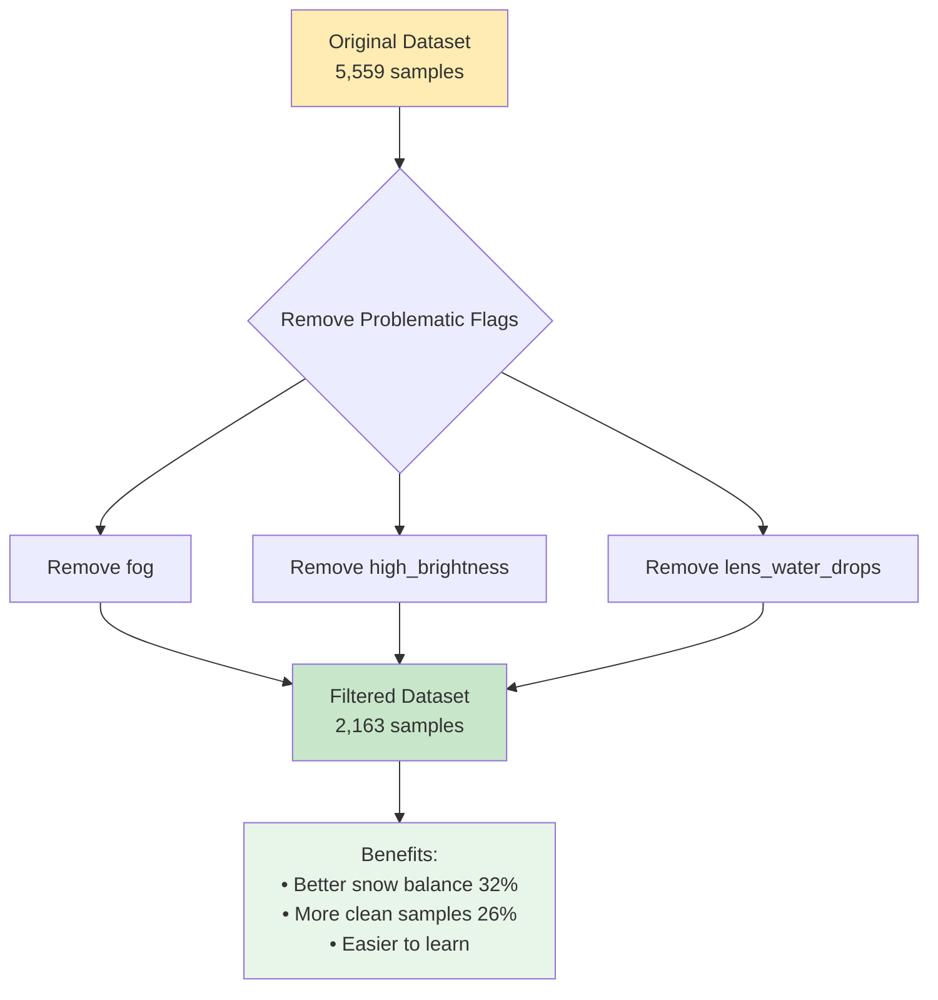
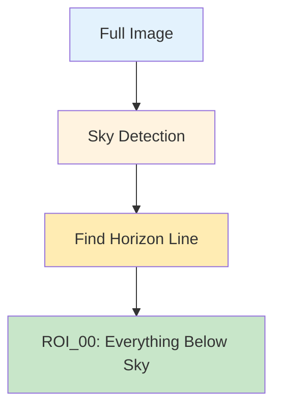

# Data Preparation Workflow

## Overview

Before we can teach a computer to recognize snow or fog in photos, we need to organize our data properly. This is like organizing your study materials before an exam!



## Step 1: Collecting Photos

Our cameras take photos automatically throughout the day:



Each photo has a special filename that tells us:
- **Where**: Which camera/station took it
- **When**: Date and time
- **What**: Type of camera

Example: `lonnstorp_LON_AGR_PL01_PHE01_2024_102_20240411_080003.jpg`
- Station: Lönnstorp
- Date: April 11, 2024 (day 102 of the year)
- Time: 08:00:03 (8 AM and 3 seconds)

## Step 2: Adding Labels

Humans look at photos and add labels. This is like a teacher marking correct answers on a test:



### How Labels are Stored

Labels are saved in special files (YAML format) that computers can read:

```yaml
filename: photo_name.jpg
annotations:
  - roi_name: ROI_00
    snow_presence: true
    flags: ['fog', 'high_brightness']
    discard: false
```

## Step 3: Quality Checking

Not all photos are good for learning. We check for problems:



### Quality Flags Explained

Think of flags as warning stickers on photos:

| Flag | What it Means | Example |
|------|---------------|---------|
| `fog` | Can't see clearly | Misty morning |
| `high_brightness` | Too much light | Bright sunshine |
| `lens_water_drops` | Water on camera | After rain |
| `blur` | Out of focus | Camera shook |

## Step 4: Creating the Dataset

We combine all photos and labels into one big table (CSV file):



### Dataset Statistics (Lönnstorp Example)

- **1,467** different photos
- **5,559** labeled regions (multiple ROIs per photo)
- **14%** have snow
- **90%** have quality issues

## Step 5: Splitting the Data

We divide our data into three groups (like dividing flashcards for studying):



### Why Three Groups?

1. **Training Set (70%)**: Photos the computer studies to learn patterns
2. **Validation Set (10%)**: Photos we check during learning to avoid memorizing
3. **Test Set (20%)**: Photos saved for the final test - never seen during learning!

### Important Rule: Keep Days Together!

Photos from the same day must stay in the same group:



### How PhenoCAI Splits Data

The dataset splitting uses a **grouped stratified approach**:

1. **Grouped by Day**: All ROIs from the same image (same day/time) stay together
   - Prevents data leakage between sets
   - Ensures fair evaluation (no peeking at similar images)

2. **Stratified by Snow Presence**: Maintains the same snow/no-snow ratio in each set
   - If overall data has 20% snow, then:
   - Training set: ~20% snow
   - Validation set: ~20% snow  
   - Test set: ~20% snow

3. **Reproducible**: Uses a fixed random seed (42) for consistent splits

This smart splitting ensures:
- No temporal data leakage
- Balanced class representation
- Reproducible results for science

## Step 6: Filtering for Complete ROI Sets

### The ROI Completeness Challenge

During the annotation process, the number of ROIs annotated per image evolved over time:



This creates an imbalance:
- **Early images** (days 1-31): Only 2 ROIs annotated per image
- **Later images** (day 32+): All 5 ROIs annotated per image

### Why This Matters for Training

Training with incomplete ROI sets can cause problems:

1. **Biased Learning**: Model learns more from ROI_00 and ROI_01 (50% more examples)
2. **Inconsistent Evaluation**: Can't fairly compare performance across all ROIs
3. **Missing Patterns**: Different ROIs capture different areas with unique snow patterns

### The Solution: Complete ROI Filtering

PhenoCAI automatically filters to only include images with all ROIs annotated:

```bash
# Default behavior: only complete ROI sets
phenocai dataset create

# For Lönnstorp: automatically filters from day 32 onwards
# This keeps ~77% of the data while ensuring consistency
```

This filtering ensures:
- **Equal representation** for all ROIs
- **Consistent training examples** 
- **Fair performance evaluation** across all ROI types
- **Better model generalization**

### Impact on Dataset Size

For Lönnstorp station:
- Before filtering: 1,467 images → 5,559 ROI annotations
- After filtering: ~1,136 images → ~5,680 ROI annotations
- **Result**: 77% of data retained, but 100% consistency!

## Step 7: Additional Filtering (Optional)

Sometimes we want even cleaner data for initial training:



## Step 8: ROI_00 for Cross-Station Work

### What is ROI_00?

ROI_00 is a special region that represents the full image minus the sky area. It's automatically calculated using advanced sky detection algorithms:



### Why Use ROI_00?

- **Universal**: Works across all stations and camera angles
- **Consistent**: Always excludes sky region
- **Automatic**: Pre-calculated and stored in stations.yaml
- **Performance**: No need to recalculate for each image

### Setting Up ROI_00

```bash
# Add ROI_00 to all stations (one-time setup)
uv run phenocai config add-roi-00

# Create dataset with only ROI_00 (for cross-station work)
uv run phenocai dataset create --roi-filter ROI_00
```

## Commands to Prepare Data

Here's how to actually do these steps:

```bash
# Step 1: Check your setup and available instruments
uv run phenocai info
uv run phenocai station instruments

# Step 1b: Switch to specific instrument if needed
uv run phenocai station switch lonnstorp --instrument LON_AGR_PL01_PHE02

# Step 2: Create the dataset with automatic train/test/val splits
uv run phenocai dataset create
# Auto-generates: lonnstorp_PHE01_dataset_2024_from_day32_splits_20_10.csv
# This automatically:
# - Filters to images from day 32+ (complete ROI sets)
# - Creates 70% train, 20% test, 10% validation splits

# To include all images (even incomplete ROI sets):
uv run phenocai dataset create --no-complete-rois-only

# For cross-station work (ROI_00 only):
uv run phenocai dataset create --roi-filter ROI_00 --no-complete-rois-only

# Step 2b: Create dataset for specific instrument
uv run phenocai dataset create --instrument LON_AGR_PL01_PHE02

# Step 3: Check the dataset info (including splits)
uv run phenocai dataset info lonnstorp_PHE01_dataset_2024_splits_20_10.csv

# Step 4: Analyze quality issues
python scripts/analyze_quality_issues.py lonnstorp_PHE01_dataset_2024_splits_20_10.csv

# Step 5: Filter if needed (auto-generates clean filename)
uv run phenocai dataset filter lonnstorp_PHE01_dataset_2024_splits_20_10.csv \
    --exclude-flags fog high_brightness
# Creates: lonnstorp_PHE01_dataset_2024_splits_20_10_no_fog_high_brightness_filtered.csv
```

## Common Problems and Solutions

### Problem: Too Many Flagged Images
**Solution**: Start with filtered dataset excluding worst flags

### Problem: Imbalanced Classes (Few Snow Images)
**Solution**: Use filtered dataset which has better balance (32% vs 14%)

### Problem: Not Enough Clean Images
**Solution**: Train separate models for different conditions (fog model, clear model)

## Summary Checklist

Before moving to training, make sure you have:
- [ ] Photos organized by date
- [ ] Labels for each photo/ROI
- [ ] Dataset CSV file created
- [ ] Complete ROI sets only (filtered from day 32+)
- [ ] Train/validation/test splits
- [ ] Checked data quality
- [ ] Decided on additional filtering strategy (if needed)

## Next Step

Now that your data is ready, proceed to [Training Workflow](workflow_training.md) to teach the computer!