# Data Preparation Workflow: Getting Photos Ready for Learning

## Overview

Before we can teach a computer to recognize snow or fog in photos, we need to organize our data properly. This is like organizing your study materials before an exam!

```mermaid
graph TD
    A[📸 Raw Photos] --> B[🏷️ Add Labels]
    B --> C[🔍 Quality Check]
    C --> D[📊 Create Dataset]
    D --> E[✂️ Split Data]
    E --> F[💾 Save for Training]
    
    style A fill:#e3f2fd
    style B fill:#fff3e0
    style C fill:#ffecb3
    style D fill:#e8f5e9
    style E fill:#f3e5f5
    style F fill:#e1f5fe
```



## Step 1: Collecting Photos 📸

Our cameras take photos automatically throughout the day:

```mermaid
graph LR
    A[6:00 AM<br/>🌅] --> B[9:00 AM<br/>☀️]
    B --> C[12:00 PM<br/>🌞]
    C --> D[3:00 PM<br/>⛅]
    D --> E[6:00 PM<br/>🌆]
    
    style A fill:#ffccbc
    style B fill:#fff9c4
    style C fill:#fff59d
    style D fill:#e1f5fe
    style E fill:#ce93d8
```



Each photo has a special filename that tells us:
- **Where**: Which camera/station took it
- **When**: Date and time
- **What**: Type of camera

Example: `lonnstorp_LON_AGR_PL01_PHE01_2024_102_20240411_080003.jpg`
- Station: Lönnstorp
- Date: April 11, 2024 (day 102 of the year)
- Time: 08:00:03 (8 AM and 3 seconds)

## Step 2: Adding Labels 🏷️

Humans look at photos and add labels. This is like a teacher marking correct answers on a test:

```mermaid
graph TD
    A[Look at Photo] --> B{What do you see?}
    B -->|Snow| C[✅ Snow Present]
    B -->|No Snow| D[❌ No Snow]
    B -->|Problems| E[⚠️ Quality Issues]
    E --> F[Add Flags:<br/>fog, blur, etc.]
    
    style A fill:#e3f2fd
    style B fill:#fff3e0
    style C fill:#c8e6c9
    style D fill:#ffcdd2
    style E fill:#ffecb3
    style F fill:#ffe0b2
```



### How Labels are Stored

Labels are saved in special files (YAML format) that computers can read:

```yaml
filename: photo_name.jpg
annotations:
  - roi_name: ROI_00
    snow_presence: true
    flags: ['fog', 'high_brightness']
    discard: false
```

## Step 3: Quality Checking 🔍

Not all photos are good for learning. We check for problems:

```mermaid
graph LR
    A[All Photos] --> B{Quality Check}
    B -->|Clean| C[✅ Good Photos<br/>10%]
    B -->|Issues| D[⚠️ Flagged Photos<br/>90%]
    
    D --> E[Common Issues:<br/>• High brightness 36%<br/>• Fog 26%<br/>• Water drops 6%]
    
    style C fill:#c8e6c9
    style D fill:#ffecb3
    style E fill:#ffe0b2
```



### Quality Flags Explained

Think of flags as warning stickers on photos:

| Flag | What it Means | Example |
|------|---------------|---------|
| 🌫️ `fog` | Can't see clearly | Misty morning |
| ☀️ `high_brightness` | Too much light | Bright sunshine |
| 💧 `lens_water_drops` | Water on camera | After rain |
| 📷 `blur` | Out of focus | Camera shook |

## Step 4: Creating the Dataset 📊

We combine all photos and labels into one big table (CSV file):

```mermaid
graph TD
    A[Photo Files] --> C[Dataset Builder]
    B[Label Files] --> C
    C --> D[Master Dataset<br/>CSV File]
    
    D --> E[Contains:<br/>• Image filename<br/>• Snow yes/no<br/>• Quality flags<br/>• ROI name<br/>• Station info]
    
    style A fill:#e3f2fd
    style B fill:#fff3e0
    style C fill:#f3e5f5
    style D fill:#c8e6c9
    style E fill:#e8f5e9
```



### Dataset Statistics (Lönnstorp Example)

- 📸 **1,467** different photos
- 🏷️ **5,559** labeled regions (multiple ROIs per photo)
- ❄️ **14%** have snow
- ⚠️ **90%** have quality issues

## Step 5: Splitting the Data ✂️

We divide our data into three groups (like dividing flashcards for studying):


### Why Three Groups?

1. **Training Set (70%)**: Photos the computer studies to learn patterns
2. **Validation Set (10%)**: Photos we check during learning to avoid memorizing
3. **Test Set (20%)**: Photos saved for the final test - never seen during learning!

### Important Rule: Keep Days Together! 📅

Photos from the same day must stay in the same group:

```mermaid
graph LR
    A[Day 1<br/>☀️☀️☀️] -->|All photos| B[Training]
    C[Day 2<br/>🌧️🌧️🌧️] -->|All photos| D[Test]
    E[Day 3<br/>❄️❄️❄️] -->|All photos| B
    
    style A fill:#c8e6c9
    style C fill:#ffcdd2
    style E fill:#e1f5fe
```



### How PhenoCAI Splits Data 🎯

The dataset splitting uses a **grouped stratified approach**:

1. **Grouped by Day**: All ROIs from the same image (same day/time) stay together
   - Prevents data leakage between sets
   - Ensures fair evaluation (no peeking at similar images)

2. **Stratified by Snow Presence**: Maintains the same snow/no-snow ratio in each set
   - If overall data has 20% snow, then:
   - Training set: ~20% snow
   - Validation set: ~20% snow  
   - Test set: ~20% snow

3. **Reproducible**: Uses a fixed random seed (42) for consistent splits

This smart splitting ensures:
- ✅ No temporal data leakage
- ✅ Balanced class representation
- ✅ Reproducible results for science

## Step 6: Filtering (Optional) 🎯

Sometimes we want cleaner data for initial training:

```mermaid
graph TD
    A[Original Dataset<br/>5,559 samples] --> B{Remove Problematic Flags}
    B --> C[Remove fog]
    B --> D[Remove high_brightness]
    B --> E[Remove lens_water_drops]
    
    C --> F[Filtered Dataset<br/>2,163 samples]
    D --> F
    E --> F
    
    F --> G[Benefits:<br/>• Better snow balance 32%<br/>• More clean samples 26%<br/>• Easier to learn]
    
    style A fill:#ffecb3
    style F fill:#c8e6c9
    style G fill:#e8f5e9
```



## Commands to Prepare Data

Here's how to actually do these steps:

```bash
# Step 1: Check your setup
uv run phenocai info

# Step 2: Create the dataset with automatic train/test/val splits
uv run phenocai dataset create --output my_dataset.csv
# This automatically creates 70% train, 20% test, 10% validation splits

# Step 3: Check the dataset info (including splits)
uv run phenocai dataset info my_dataset.csv

# Step 4: Analyze quality issues
python scripts/analyze_quality_issues.py my_dataset.csv

# Step 5: Filter if needed (preserves splits)
uv run phenocai dataset filter my_dataset.csv clean_dataset.csv \
    --exclude-flags fog high_brightness
```

## Common Problems and Solutions

### Problem: Too Many Flagged Images
**Solution**: Start with filtered dataset excluding worst flags

### Problem: Imbalanced Classes (Few Snow Images)
**Solution**: Use filtered dataset which has better balance (32% vs 14%)

### Problem: Not Enough Clean Images
**Solution**: Train separate models for different conditions (fog model, clear model)

## Summary Checklist ✅

Before moving to training, make sure you have:
- [ ] Photos organized by date
- [ ] Labels for each photo/ROI
- [ ] Dataset CSV file created
- [ ] Train/validation/test splits
- [ ] Checked data quality
- [ ] Decided on filtering strategy

## Next Step

Now that your data is ready, proceed to [Training Workflow](workflow_training.md) to teach the computer!