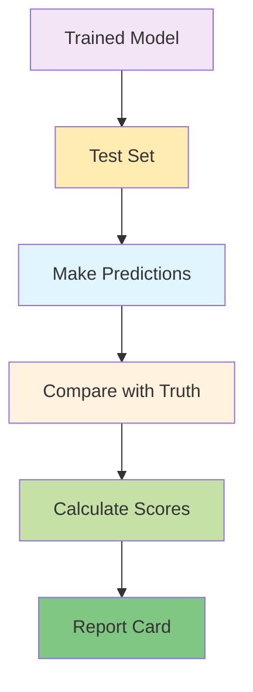
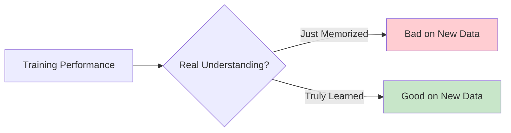
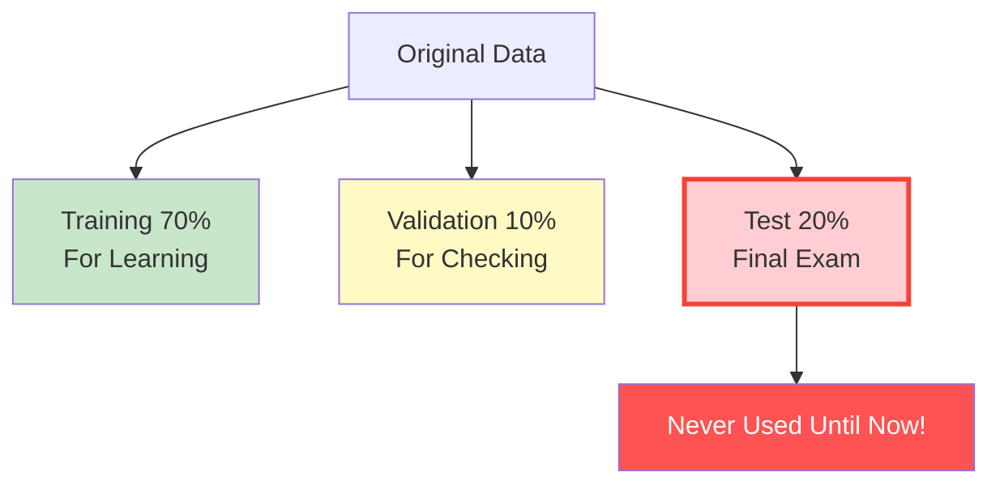
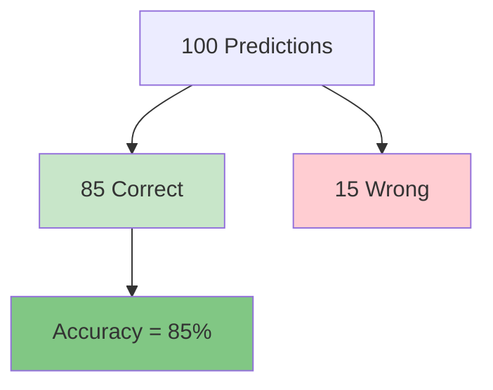
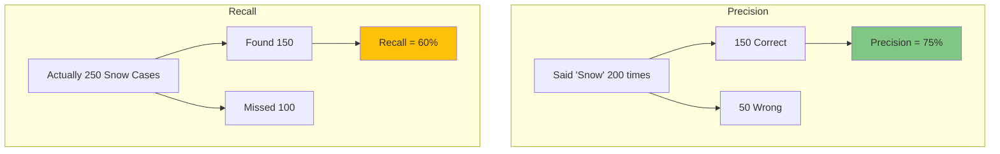
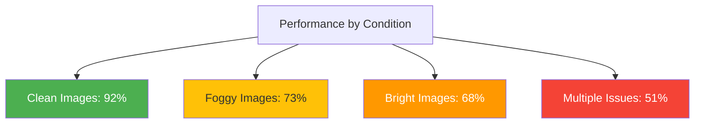
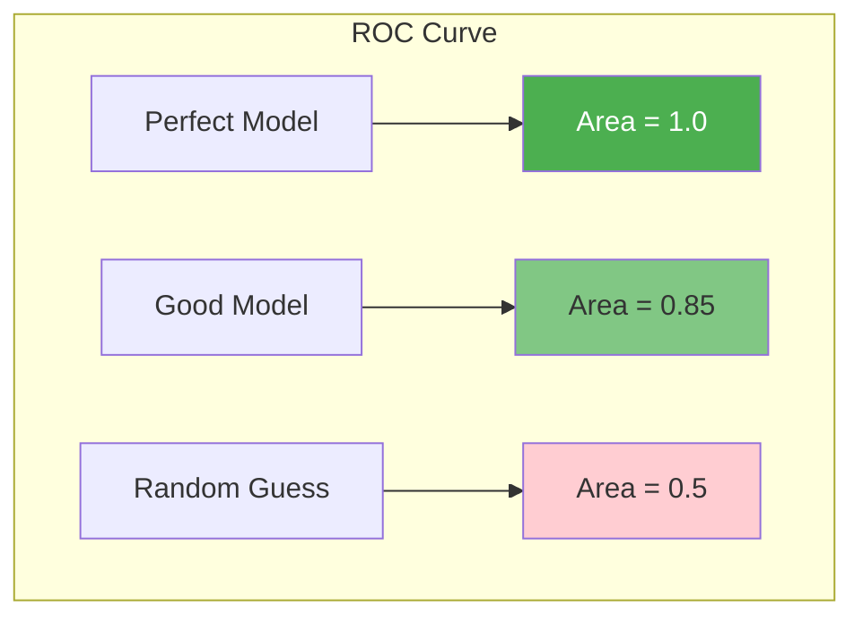
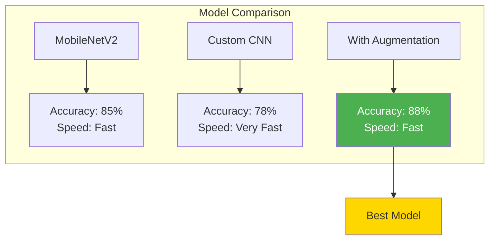

# Evaluation Workflow: Testing What the Computer Learned

## Overview

Evaluation is like giving the trained model a final exam. We test it on photos it has never seen before to check if it really learned or just memorized.



## Why Evaluate?

Imagine a student who memorized all the answers to practice questions but can't solve new problems. We need to check if our model truly understands!



## The Test Set: Never Seen Before!

Remember our data split? The test set was kept hidden during training:



## Evaluation Metrics Explained Simply

### 1. Accuracy: Overall Score



**Accuracy** = How many you got right out of total

### 2. Confusion Matrix: Detailed Breakdown


This shows:
- **True Positives (150)**: Correctly found snow
- **True Negatives (800)**: Correctly found no snow
- **False Positives (50)**: Said snow when there wasn't
- **False Negatives (100)**: Missed snow that was there

### 3. Precision and Recall: Different Perspectives



- **Precision**: When you say "snow", how often are you right?
- **Recall**: Of all snow cases, how many did you find?

### 4. F1 Score: The Balance


F1 Score balances precision and recall (like averaging them smartly).

## Evaluation by Categories

### By ROI (Region of Interest)


### By Quality Condition



## Visual Evaluation Tools

### 1. ROC Curve (How Well We Separate Classes)



Better models have curves closer to the top-left corner.

### 2. Prediction Examples

```mermaid
graph TD

subgraph Correct_Predictions

A[Clear Snow] --> B[Predicted: Snow (Correct)]

C[Sunny Day] --> D[Predicted: No Snow (Correct)]

end

subgraph Wrong_Predictions

E[Light Snow] --> F[Predicted: No Snow (Wrong)]

G[Bright Ground] --> H[Predicted: Snow (Wrong)]

end

style B fill:#c8e6c9

style D fill:#c8e6c9

style F fill:#ffcdd2

style H fill:#ffcdd2
```

## Error Analysis

Understanding why the model makes mistakes:


## Performance by Time of Day


## Comparing Models

When you train multiple models, compare them:



## Evaluation Commands (When Implemented)

```bash
# Basic evaluation
uv run phenocai evaluate model saved_model.h5 test_dataset.csv

# Detailed analysis
uv run phenocai evaluate model saved_model.h5 test_dataset.csv \
    --save-predictions \
    --generate-plots \
    --output-dir results/

# Compare multiple models
uv run phenocai evaluate benchmark \
    --models-dir trained_models/ \
    --dataset test_dataset.csv
```

## Evaluation Report Card

A good evaluation report includes:


## Understanding Results

### Good Results Look Like:
- High accuracy (>80%)
- Balanced precision and recall
- Good performance across all ROIs
- Handles common quality issues

### Warning Signs:
- Big gap between training and test accuracy
- Very low recall (missing many cases)
- Poor performance on specific conditions
- Works only on clean images

## Making Improvements

Based on evaluation results:


## Evaluation Checklist

- [ ] Test set never used during training
- [ ] Calculate multiple metrics (not just accuracy)
- [ ] Check performance by category (ROI, condition)
- [ ] Analyze common errors
- [ ] Compare with baseline/other models
- [ ] Generate visual reports
- [ ] Document findings

## Next Step

Once you're happy with evaluation results, proceed to [Prediction Workflow](workflow_prediction.md) to use your model on new data!