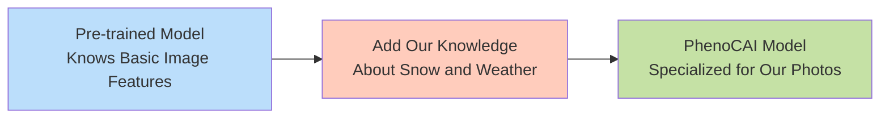

# PhenoCAI Workflow Overview: A Beginner's Guide

## What is PhenoCAI?

Imagine you have thousands of photos taken by cameras watching nature every day. PhenoCAI is like a smart assistant that learns to look at these photos and answer questions like:
- "Is there snow in this picture?"
- "Is the image too blurry to use?"
- "Are there any problems with the camera lens?"

This document explains how PhenoCAI works, step by step, using simple language and visual diagrams.

## The Big Picture

```mermaid
graph TD
    A[📷 Camera Takes Photos] --> B[🏷️ Humans Label Some Photos]
    B --> C[🤖 Computer Learns Patterns]
    C --> D[🔍 Computer Labels New Photos]
    D --> E[📊 Scientists Use Results]
    
    style A fill:#e1f5fe
    style B fill:#fff3e0
    style C fill:#f3e5f5
    style D fill:#e8f5e9
    style E fill:#fce4ec
```

## Key Concepts

### 1. What is Transfer Learning?

Transfer learning is like teaching someone to ride a motorcycle when they already know how to ride a bicycle. We use knowledge from one task to help with another similar task.

### 2. What are ROIs (Regions of Interest)?

Instead of looking at the whole photo, we often focus on specific parts:

```mermaid
graph TD
    A[Full Image 📷] --> B[ROI_00: Whole Image]
    A --> C[ROI_01: Sky Area]
    A --> D[ROI_02: Ground Area]
    A --> E[ROI_03: Tree Area]
    
    style A fill:#e3f2fd
    style B fill:#f5f5f5
    style C fill:#e1f5fe
    style D fill:#a5d6a7
    style E fill:#81c784
```

### 3. What are Quality Flags?

Quality flags are like warning labels on photos:

```mermaid
graph LR
    A[Photo] --> B{Quality Check}
    B -->|Good| C[✅ Clean Image]
    B -->|Issues| D[⚠️ Has Flags]
    D --> E[🌫️ Fog]
    D --> F[☀️ Too Bright]
    D --> G[💧 Water Drops]
    D --> H[📷 Blurry]
    
    style C fill:#c8e6c9
    style D fill:#ffecb3
    style E fill:#e1f5fe
    style F fill:#fff9c4
    style G fill:#b3e5fc
    style H fill:#d1c4e9
```

## The Three Main Stages

### Stage 1: Prepare the Data 📚
We organize our photos and labels so the computer can learn from them.

### Stage 2: Train the Model 🎓
The computer studies the labeled photos to learn patterns.

### Stage 3: Use the Model 🚀
The trained model can now label new photos automatically.

## Why Do We Need This?

Scientists use cameras to watch how nature changes through the seasons. But with thousands of photos every day, it's impossible for humans to look at them all. PhenoCAI helps by:

1. **Saving Time**: Automatically labeling thousands of photos
2. **Being Consistent**: Always using the same rules
3. **Finding Patterns**: Spotting changes humans might miss
4. **Working 24/7**: Processing photos day and night

## Next Steps

Now that you understand the big picture, let's dive deeper into each stage:

1. [Data Preparation Workflow](workflow_data_preparation.md) - How we get photos ready for learning
2. [Training Workflow](workflow_training.md) - How the computer learns
3. [Evaluation Workflow](workflow_evaluation.md) - How we check if it learned well
4. [Prediction Workflow](workflow_prediction.md) - How we use it on new photos

## Glossary

- **Model**: A computer program that has learned to recognize patterns
- **Dataset**: A collection of photos with labels
- **Training**: Teaching the computer by showing it examples
- **ROI**: Region of Interest - a specific part of a photo
- **Flag**: A label indicating a quality issue with a photo
- **Transfer Learning**: Using knowledge from one task to help with another