# Training Workflow: Teaching the Computer to See

## Overview

Training is like teaching a student by showing them many examples. The computer looks at labeled photos over and over until it learns the patterns.

```mermaid
graph TD
    A[📚 Prepared Data] --> B[🧠 Neural Network]
    B --> C[🔄 Learning Loop]
    C --> D[📈 Check Progress]
    D -->|Not Good Enough| C
    D -->|Good Enough| E[💾 Save Model]
    
    style A fill:#e3f2fd
    style B fill:#f3e5f5
    style C fill:#fff9c4
    style D fill:#ffecb3
    style E fill:#c8e6c9
```



## What is a Neural Network? 🧠

Think of a neural network as a series of filters that learn to recognize patterns:


## Transfer Learning: The Smart Shortcut 🚀

Instead of starting from scratch, we use a pre-trained model (MobileNetV2) that already knows basic image features:

```mermaid
graph TD
    A[MobileNetV2<br/>Pre-trained Model] --> B[Knows:<br/>• Edges<br/>• Textures<br/>• Shapes<br/>• Objects]
    B --> C[Freeze Early Layers<br/>Keep this knowledge]
    C --> D[Add New Layers<br/>Learn snow/weather]
    D --> E[PhenoCAI Model<br/>Specialized for our task]
    
    style A fill:#bbdefb
    style B fill:#e1f5fe
    style C fill:#fff9c4
    style D fill:#c5e1a5
    style E fill:#81c784
```



### Why Transfer Learning?

1. **Faster**: Learn in hours instead of days
2. **Better**: Start with proven knowledge
3. **Less Data**: Need fewer examples
4. **Cheaper**: Use less computing power

## The Training Process 🏃‍♂️

### Step 1: Load the Data


**Batch Processing**: Like studying flashcards in groups of 32 instead of all at once.

### Step 2: Forward Pass (Making Predictions)


### Step 3: Backward Pass (Learning from Mistakes)


### Step 4: Training Loop (Practice Makes Perfect)


**Epoch**: One complete pass through all training data (like reading a textbook once).

## Key Concepts Explained Simply

### Learning Rate 📊

How big steps the model takes when learning:


### Overfitting vs Underfitting 🎯


### Loss Function (How Wrong We Are) 📉

The loss function measures mistakes:


## Training Parameters 🎛️

| Parameter | What it Does | Typical Value | Analogy |
|-----------|--------------|---------------|---------|
| Epochs | How many times to study | 20 | Reading a book 20 times |
| Batch Size | Images per group | 32 | Flashcards per session |
| Learning Rate | How fast to learn | 0.001 | Walking speed |
| Validation Split | Data for checking | 10% | Practice quiz |

## Monitoring Training 📊

### Loss Curves


### Early Stopping

Stop training when validation performance stops improving:


## Data Augmentation 🎨

Making training data more diverse by creating variations:

```mermaid
graph TD
    A[Original Image] --> B[Rotate ±15°]
    A --> C[Flip Horizontal]
    A --> D[Adjust Brightness]
    A --> E[Add Noise]
    
    B --> F[5x More Training Data!]
    C --> F
    D --> F
    E --> F
    
    style A fill:#e3f2fd
    style F fill:#c8e6c9
```



## Fine-Tuning Strategy 🎯

Two-stage training for better results:


## Common Training Problems and Solutions

### Problem: Loss Not Decreasing


### Problem: Validation Loss Increasing


## Training Commands

```bash
# Basic training with MobileNetV2
uv run phenocai train model dataset.csv --epochs 20

# With custom parameters
uv run phenocai train model dataset.csv \
    --model-type mobilenet \
    --batch-size 32 \
    --learning-rate 0.001 \
    --epochs 30

# Train simple CNN (faster, lower accuracy)
uv run phenocai train model dataset.csv \
    --model-type simple-cnn \
    --epochs 30 \
    --batch-size 64

# Train with specific output directory
uv run phenocai train model dataset.csv \
    --model-type mobilenet \
    --output-dir trained_models/experiment_1/
```

The training system will:
- Automatically handle train/test/val splits from your dataset
- Apply data augmentation to training images
- Save checkpoints during training
- Track best model based on validation accuracy
- Generate training history plots

## Training Checklist ✅

- [ ] Data loaded correctly
- [ ] Model architecture chosen
- [ ] Training parameters set
- [ ] Validation data separate
- [ ] Monitoring setup
- [ ] Early stopping enabled
- [ ] Best model saving enabled

## What Happens Next?

After training completes:
1. **Best model saved** → Contains learned knowledge
2. **Training history saved** → Shows how learning progressed
3. **Ready for evaluation** → Time to test how well it learned!

## Next Step

Proceed to [Evaluation Workflow](workflow_evaluation.md) to test your trained model!