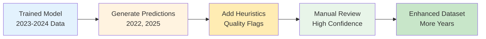
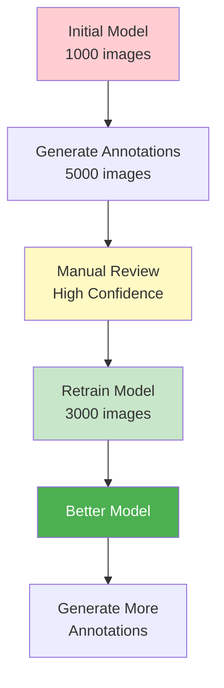

# Annotation Generation Workflow

## Overview

PhenoCAI can generate annotations for unannotated images using trained models combined with heuristics. This creates a powerful workflow for expanding your dataset across years and stations.



## Why Generate Annotations?

### 1. **Expand Temporal Coverage**
- Train on 2023-2024 → Annotate 2022, 2025
- Build multi-year datasets
- Study long-term trends

### 2. **Cross-Station Annotation**
- Train on Station A → Annotate Station B
- Bootstrap new stations quickly
- Reduce manual annotation effort

### 3. **Quality Flag Enhancement**
- Models detect snow presence
- Heuristics add quality flags
- Combine for complete annotations

## Workflow 1: Basic Annotation Generation

### Step 1: Train High-Quality Model
```bash
# Use clean, balanced data for best model
uv run phenocai dataset create --roi-filter ROI_00
uv run phenocai train model dataset.csv --preset mobilenet_full
```

### Step 2: Generate Predictions for New Year
```bash
# Generate annotations for 2022
uv run phenocai predict batch /path/to/model.h5 \
    --year 2022 \
    --roi-filter ROI_00 \
    --use-heuristics \
    --format yaml \
    --output-dir annotations_2022
```

### Step 3: Review and Filter by Confidence
```bash
# Only accept high-confidence predictions
uv run phenocai cross-station merge-predictions \
    annotations_2022 \
    --confidence-threshold 0.85 \
    --output reviewed_annotations_2022
```

## Workflow 2: Cross-Station Annotation Pipeline

The complete pipeline automates all steps:

```bash
# Full cross-station pipeline with annotation generation
uv run phenocai cross-station pipeline \
    --train-stations lonnstorp \
    --eval-stations robacksdalen abisko \
    --years 2023 2024 \
    --annotation-years 2022 2025 \
    --use-heuristics
```

This single command:
1. Creates training dataset from Lönnstorp 2023-2024
2. Trains model with ROI_00
3. Evaluates on Röbäcksdalen and Abisko
4. Generates annotations for 2022 and 2025
5. Adds heuristic quality flags

## Workflow 3: Iterative Improvement



### Implementation:
```bash
# Round 1: Initial training
uv run phenocai train model initial_dataset.csv

# Generate annotations
uv run phenocai predict batch model_v1.h5 --year 2022 --use-heuristics

# Review and filter
uv run phenocai cross-station merge-predictions \
    predictions_2022 \
    --confidence-threshold 0.9

# Round 2: Retrain with expanded dataset
uv run phenocai dataset create --include-predicted  # Future feature
uv run phenocai train model expanded_dataset.csv
```

## Heuristic Integration

The `--use-heuristics` flag adds rule-based quality detection:

### Snow-Related Heuristics
```python
# Heuristics provide initial quality assessment
quality_flags = []

# Snow detection affects visibility
if detect_snow_coverage(image) > 0.8:
    quality_flags.append('heavy_snow')
    
# Lens snow detection
if detect_lens_snow(image):
    quality_flags.append('lens_snow')
```

### Quality Heuristics
```python
# Brightness analysis
if mean_brightness > 240:
    quality_flags.append('high_brightness')
elif mean_brightness < 30:
    quality_flags.append('low_brightness')

# Blur detection
if calculate_blur_score(image) > threshold:
    quality_flags.append('blur')
```

## Confidence Thresholds

### Recommended Thresholds by Use Case

| Use Case | Snow Threshold | Quality Threshold | Notes |
|----------|---------------|-------------------|--------|
| **High Precision** | 0.90 | 0.85 | Manual review minimal |
| **Balanced** | 0.80 | 0.75 | Good accuracy/coverage |
| **High Coverage** | 0.70 | 0.65 | More manual review |
| **Bootstrap New Station** | 0.85 | 0.80 | Conservative for new data |

### Confidence Interpretation
```yaml
# High confidence annotation (accept automatically)
- roi_name: ROI_00
  snow_presence: true
  snow_probability: 0.95  # Very confident
  quality_flags: ['clouds']
  confidence: 0.92

# Medium confidence (review recommended)  
- roi_name: ROI_00
  snow_presence: false
  snow_probability: 0.72  # Less certain
  quality_flags: ['fog', 'low_brightness']
  confidence: 0.68

# Low confidence (manual annotation needed)
- roi_name: ROI_00
  snow_presence: true
  snow_probability: 0.51  # Barely over threshold
  quality_flags: ['unusable']
  confidence: 0.45
```

## Manual Review Strategy

### 1. **Priority Review Queue**
Focus manual effort on:
- Borderline predictions (0.4 < probability < 0.6)
- Images with many quality flags
- Rare conditions (first/last snow)

### 2. **Batch Review Tools**
```bash
# Export uncertain predictions for review
uv run phenocai predict export-uncertain \
    predictions_dir \
    --probability-range 0.4 0.6 \
    --output review_queue.csv
```

### 3. **Active Learning**
Retrain periodically with reviewed annotations:
```bash
# After reviewing 500 uncertain images
uv run phenocai dataset merge \
    original_dataset.csv \
    reviewed_annotations.csv \
    --output enhanced_dataset.csv

# Retrain for better performance
uv run phenocai train model enhanced_dataset.csv
```

## Best Practices

### 1. **Start Conservative**
- High confidence thresholds (>0.85)
- Review sample before bulk accepting
- Lower thresholds gradually

### 2. **Station-Specific Tuning**
```bash
# Different stations may need different thresholds
--confidence-threshold 0.85  # Lönnstorp (training station)
--confidence-threshold 0.90  # Röbäcksdalen (different climate)
```

### 3. **Temporal Validation**
Check predictions make seasonal sense:
- No snow in July (northern hemisphere)
- Snow transitions gradual
- Quality issues weather-dependent

### 4. **Combine Multiple Models**
```python
# Ensemble for robust predictions
predictions = [
    model1.predict(image),
    model2.predict(image),
    model3.predict(image)
]
final_prediction = np.median(predictions)
confidence = np.std(predictions)  # Lower std = higher confidence
```

## Example: Complete Multi-Year Workflow

```bash
# 1. Setup
export TRAIN_YEARS="2023 2024"
export PREDICT_YEARS="2021 2022 2025"

# 2. Run complete pipeline
uv run phenocai cross-station pipeline \
    --train-stations lonnstorp robacksdalen \
    --eval-stations abisko grimso \
    --years $TRAIN_YEARS \
    --annotation-years $PREDICT_YEARS \
    --roi-filter ROI_00 \
    --use-heuristics \
    --output-dir multi_year_analysis

# 3. Review results
cd multi_year_analysis/predictions
ls -la  # See generated annotations by station/year

# 4. Merge high-confidence predictions
uv run phenocai cross-station merge-predictions \
    predictions/ \
    --confidence-threshold 0.85 \
    --format csv \
    --output final_annotations.csv

# 5. Create enhanced dataset
uv run phenocai dataset create \
    --include-annotations final_annotations.csv \
    --output enhanced_multi_year_dataset.csv
```

## Output Structure

```
multi_year_analysis/
├── pipeline_summary.json
├── train_lonnstorp_robacksdalen_2023_2024_roi_00.csv
├── model_mobilenet_lonnstorp_robacksdalen/
│   ├── final_model.h5
│   └── training_history.json
├── evaluations/
│   ├── abisko/
│   │   └── evaluation_results.json
│   └── grimso/
│       └── evaluation_results.json
└── predictions/
    ├── lonnstorp/
    │   ├── 2021/
    │   ├── 2022/
    │   └── 2025/
    └── robacksdalen/
        ├── 2021/
        ├── 2022/
        └── 2025/
```

## Summary

Annotation generation with PhenoCAI:
- **Expands datasets** across years and stations
- **Combines ML and heuristics** for complete annotations
- **Confidence-based filtering** for quality control
- **Iterative improvement** through retraining
- **Production-ready pipeline** for large-scale annotation