# Prediction Workflow: Using Your Trained Model on New Photos

## Overview

Now that we have a trained and tested model, it's time to put it to work! This is like having a trained assistant who can label thousands of photos automatically.

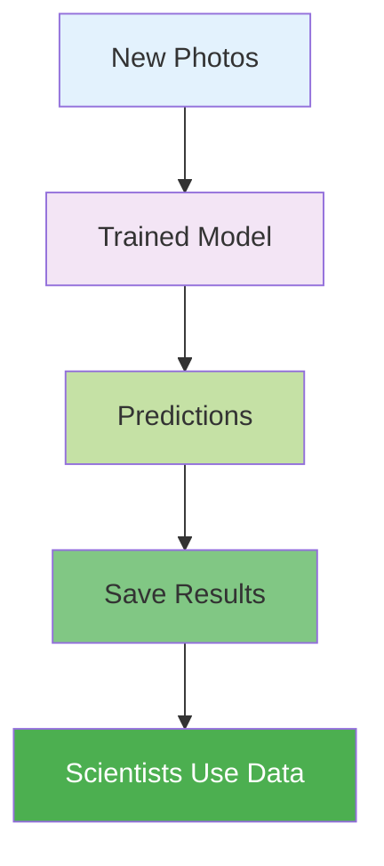

## The Prediction Pipeline

### Step 1: Collect New Photos

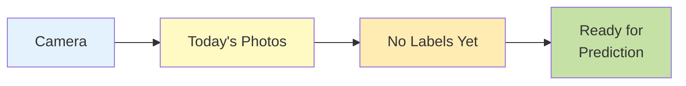

These photos are completely new - taken after the model was trained.

### Step 2: Load the Model

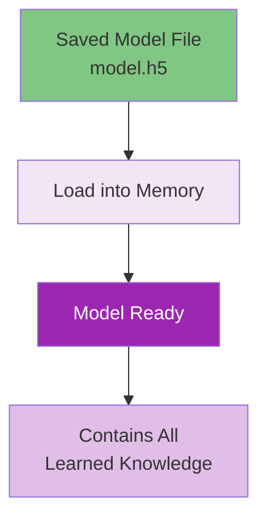

### Step 3: Process Images

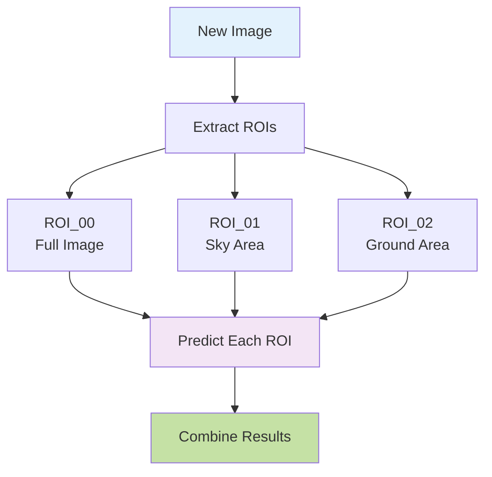

### Step 4: Make Predictions

For each image and ROI, the model outputs probabilities:

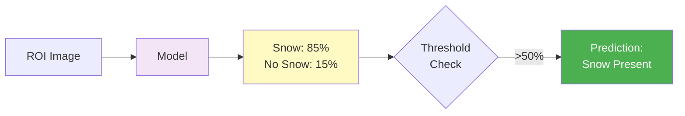

## Batch Processing for Efficiency

Instead of one image at a time, we process in batches:

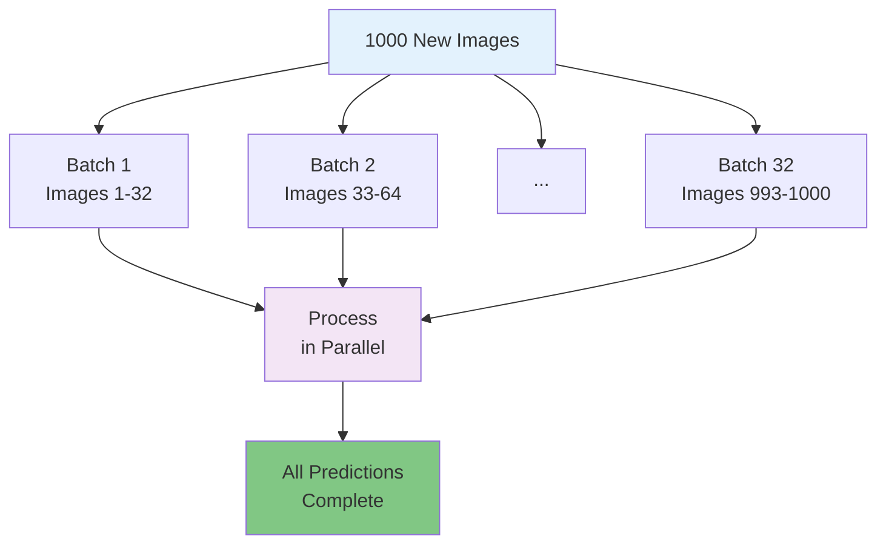

**Why Batches?**
- Much faster than one-by-one
- Better memory usage
- GPU processes multiple images at once

## Confidence Scores

The model doesn't just say "yes" or "no" - it gives confidence levels:

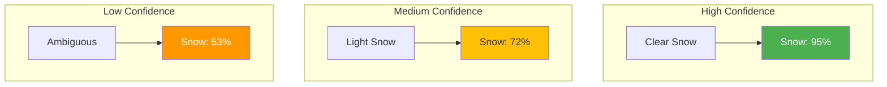

### Using Confidence Thresholds

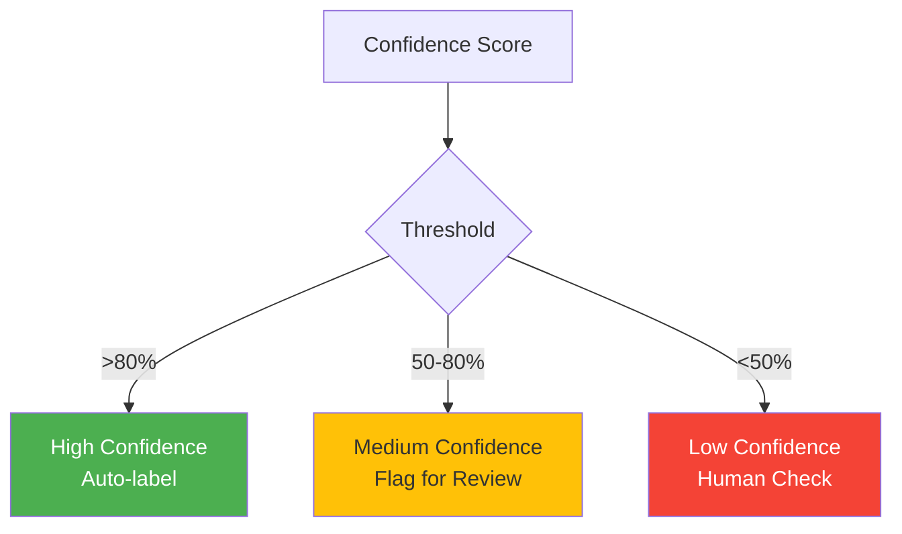

## Handling Quality Issues

PhenoCAI automatically detects and handles problematic images:

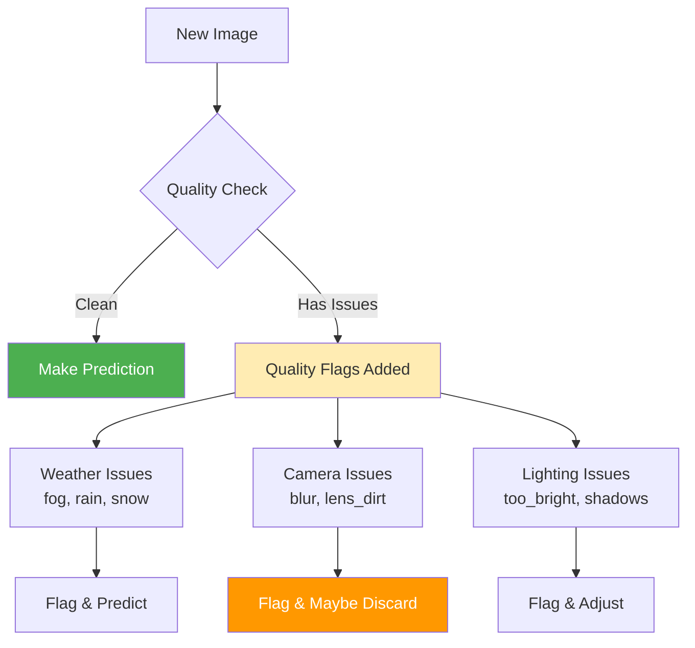

### Automatic Discard Detection

Some ROIs are automatically marked for discard:

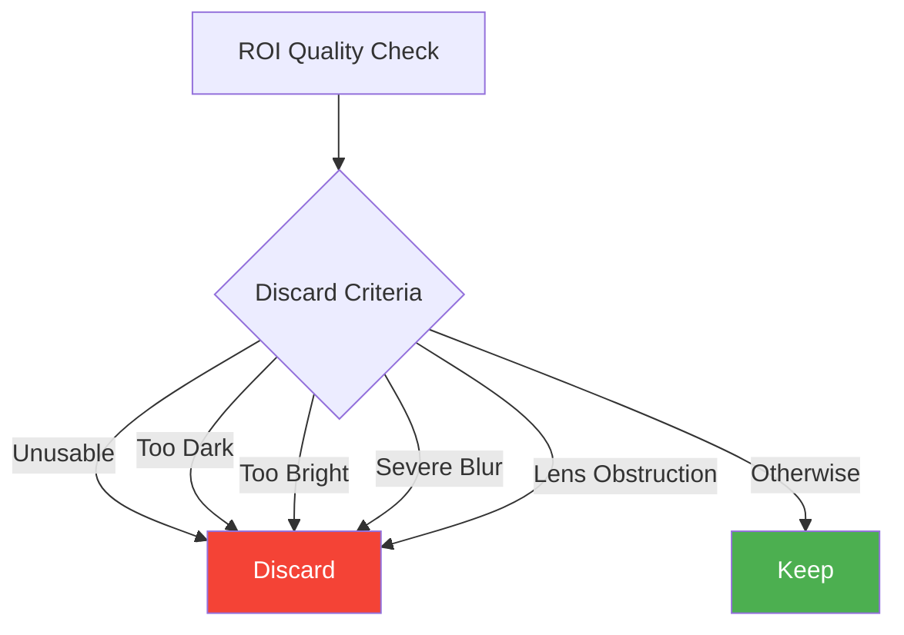

### Quality Flags Detected

PhenoCAI detects 20+ quality issues:

| Category | Flags | Impact |
|----------|-------|--------|
| **Weather** | fog, rain, snow, clouds | May affect accuracy |
| **Camera** | blur, lens_water_drops, lens_dirt, lens_snow | Often need discard |
| **Lighting** | high_brightness, low_brightness, shadows, glare | Affects visibility |
| **Other** | heterogeneous_illumination, sun_altitude_low | Special handling |

## Output Formats

### Individual Annotation Files

```yaml
filename: new_image_2024_150_20240529_080003.jpg
created: '2024-05-29T10:15:00'
model_path: 'trained_models/mobilenet/final_model.h5'
threshold: 0.5
station: 'lonnstorp'
instrument: 'LON_AGR_PL01_PHE01'
year: '2024'
day_of_year: '150'
status: 'completed'
annotations:
  - roi_name: ROI_00
    discard: false
    snow_presence: true
    flags: []
    not_needed: false
    snow_probability: 0.87
    confidence: 0.74
    model_predicted: true
  - roi_name: ROI_01
    discard: true
    snow_presence: false
    flags: ['blur', 'low_brightness']
    not_needed: false
    snow_probability: 0.08
    confidence: 0.84
    model_predicted: true
```

### Batch Results CSV

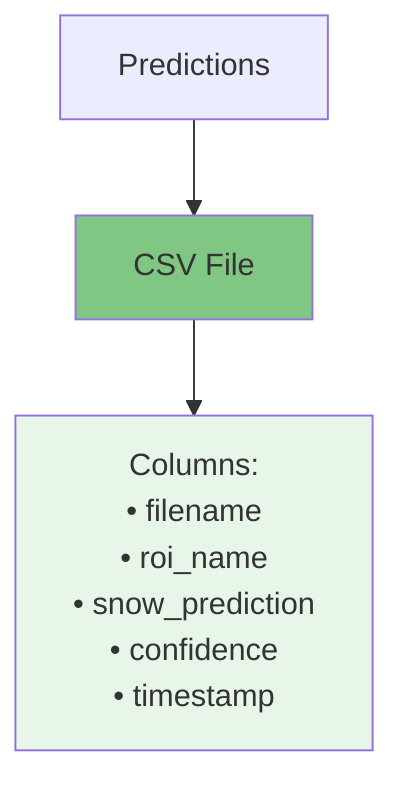

## Real-Time vs Batch Processing

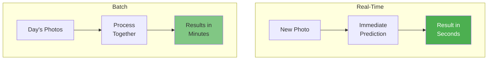

**When to use each:**
- **Real-Time**: Urgent monitoring, alerts
- **Batch**: Daily processing, research analysis

## Quality Control in Production

### Monitoring Model Performance

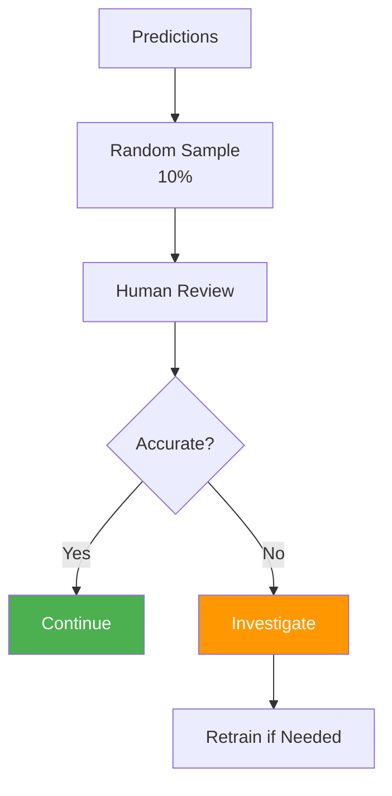

### Drift Detection

Models can become less accurate over time:


**Causes of drift:**
- Camera gets dirty
- Seasonal changes
- Camera adjustments

## Prediction Commands (Fully Implemented)

The prediction system is now fully operational with quality-aware predictions and batch processing capabilities.

```bash
# Set up environment
source src/phenocai/config/env.sh

# Predict single image with quality detection
uv run phenocai predict apply model.h5 \
    --image path/to/new_photo.jpg

# Batch process directory with heuristics
uv run phenocai predict batch model.h5 \
    --directory /2024/ \
    --output-dir predictions/ \
    --format yaml \
    --use-heuristics

# Process specific date range
uv run phenocai predict batch model.h5 \
    --start-day 150 \
    --end-day 180 \
    --year 2024 \
    --output-dir seasonal_predictions/

# Export predictions to multiple formats
uv run phenocai predict export predictions/ \
    --format csv \
    --output predictions.csv
# Supported formats: yaml, csv, json
```

The system includes:
- Automatic quality flag detection (blur, brightness issues, etc.)
- Discard recommendations for poor quality images
- Confidence scores for all predictions
- Efficient batch processing with progress tracking
- Support for processing entire years of phenocam data

## Integration with Research Workflow

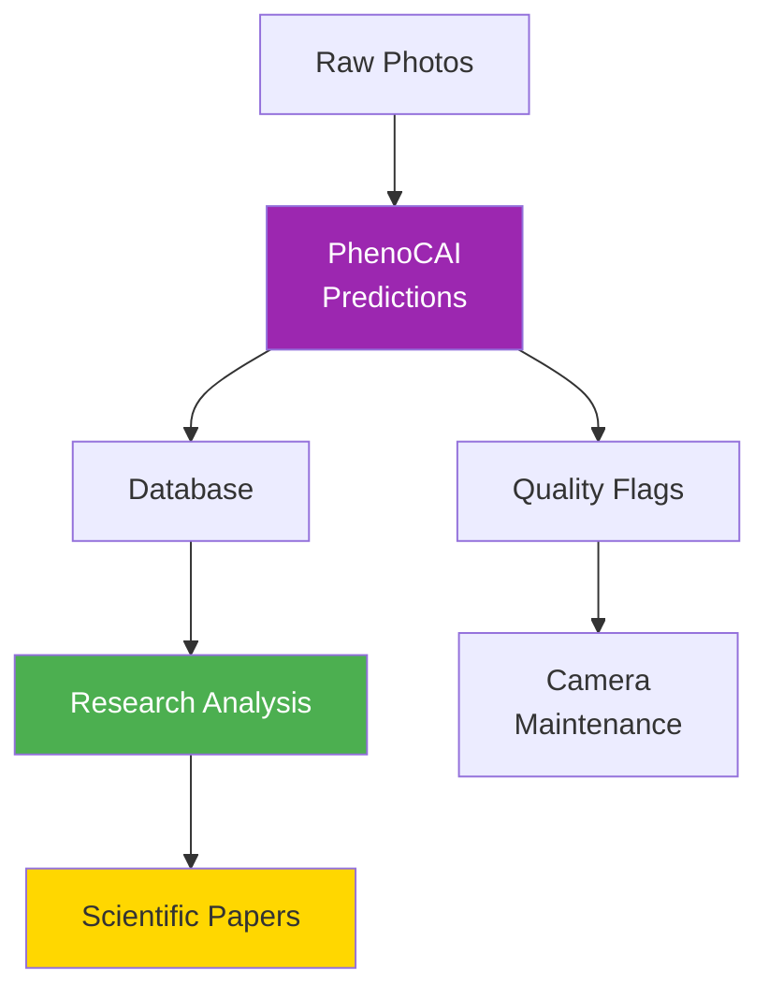

## Best Practices

### 1. Version Control

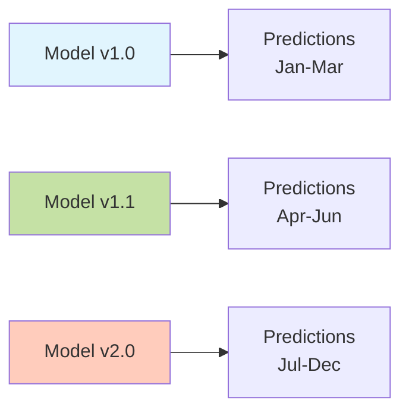

Always track which model version made each prediction!

### 2. Confidence Thresholds

- **Research**: Use high threshold (>80%) for accuracy
- **Monitoring**: Use lower threshold (>50%) to catch more cases
- **Always save**: Keep confidence scores for later analysis

### 3. Regular Validation

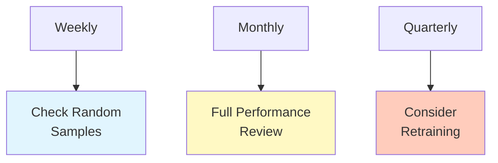

## Troubleshooting Common Issues

### Issue: Slow Predictions
- **Solution**: Increase batch size
- **Solution**: Use GPU if available
- **Solution**: Reduce image resolution

### Issue: Low Confidence Scores
- **Solution**: Check image quality
- **Solution**: Verify ROI extraction
- **Solution**: Consider retraining

### Issue: Unexpected Results
- **Solution**: Compare with training data
- **Solution**: Check for camera changes
- **Solution**: Validate preprocessing

## Success Metrics

Your prediction system is working well when:

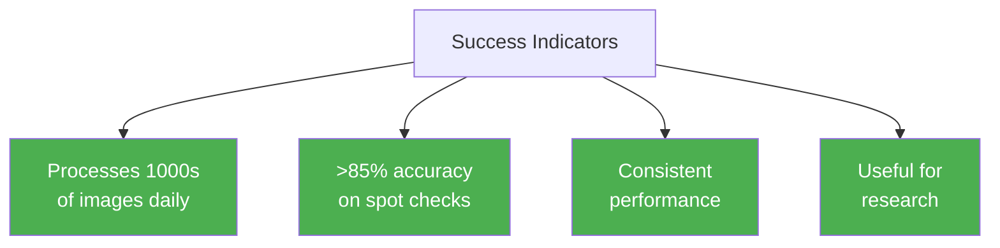

## Summary: From Photos to Science


## Checklist for Production Use

- [ ] Model tested and validated
- [ ] Batch processing configured
- [ ] Output format decided
- [ ] Confidence thresholds set
- [ ] Quality control process in place
- [ ] Version tracking system
- [ ] Performance monitoring
- [ ] Backup and recovery plan

## Congratulations!

You now understand the complete PhenoCAI workflow:
1. **Prepare** → Organize and label data
2. **Train** → Teach the model
3. **Evaluate** → Test performance
4. **Predict** → Use on new data

Your trained model is now ready to help scientists monitor environmental changes automatically!